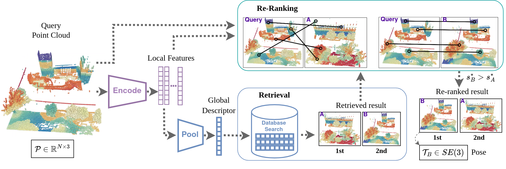

# SpectralGV
This repository is the official open-source implementation of the [RA-L](https://ieeexplore.ieee.org/document/10065560) paper: 

> <b>[Spectral Geometric Verification: Re-Ranking Point Cloud Retrieval for Metric Localization](https://arxiv.org/abs/2210.04432)</b> <br>
> [Kavisha Vidanapathirana](https://kavisha725.github.io/), [Peyman Moghadam](https://people.csiro.au/m/p/peyman-moghadam), [Sridha Sridharan](https://staff.qut.edu.au/staff/s.sridharan), [Clinton Fookes](https://staff.qut.edu.au/staff/c.fookes)<br>

This repository contains the code for:
- Integration of *SpectralGV* re-ranking with 3 open-source metric localization architectures.
- Evaluation of place recognition and metric localization with and without re-ranking on 5 open-source datasets.

## Method overview.
*SpectralGV* is an efficient spectral method for geometric verification based re-ranking of point clouds. *SpectralGV* allows integration with any metric-localization architecture that extracts both local and global features for a given point cloud, without modifying the architectures and without further training of learning-based methods. 




### UPDATES
- [x] Add environment setup instructions 
- [x] Add dataset preparation instructions
- [ ] Add SpetralGV + EgoNN
- [ ] Add SpetralGV + LCDNet
- [ ] Add SpetralGV + LoGG3D-Net

## Set up

### Prerequisites
This project has been tested on Ubuntu 22.04. Set up the requirements as follows:


<details>
  <summary><b>Set up environment</b></summary><br/>
  
  - Create [conda](https://docs.conda.io/en/latest/) environment with pytorch:
  ```bash
  conda create --name sgv_env python=3.9.4
  conda activate sgv_env
  ```
  - Install PyTorch with suitable cudatoolkit version. See [here](https://pytorch.org/):
  ```bash
  pip3 install torch torchvision torchaudio
  # Make sure the pytorch cuda version matches your output of 'nvcc --version'
  ```

</details>


<details>
  <summary><b>Add dependencies for LoGG3D-Net:</b></summary><br/>
  
  - Install [Open3d](https://github.com/isl-org/Open3D), [Torchpack](https://github.com/zhijian-liu/torchpack):
  ```bash
  pip install open3d
  pip install torchpack
  ```
  - Install torchsparse-1.4.0
  ```bash
  sudo apt-get install libsparsehash-dev
  pip install --upgrade git+https://github.com/mit-han-lab/torchsparse.git@v1.4.0
  ```
  - Install [mpi4py](https://mpi4py.readthedocs.io/en/stable/tutorial.html):
  ```bash
  conda install mpi4py
  conda install openmpi
  ```
  - Test installation using:
  ```bash
  python -c "import torch ; import torchsparse ; print(torch.cuda.is_available())"
  ```

  > **Note**: If stuck, see here for more details: https://github.com/csiro-robotics/LoGG3D-Net

</details>


<details>
  <summary><b>Add dependencies for EgoNN:</b></summary><br/>

  - Install [MinkowskiEngine](https://github.com/NVIDIA/MinkowskiEngine) 0.5.4
  ```bash
  conda install openblas-devel -c anaconda
  pip install -U git+https://github.com/NVIDIA/MinkowskiEngine -v --no-deps --install-option="--blas_include_dirs=${CONDA_PREFIX}/include" --install-option="--blas=openblas"
  ```
  - Install other dependencies:
  ```bash
  pip install pytorch_metric_learning python-lzf wandb
  ```
  - Test installation using:
  ```bash
  python -c "import torch ; import MinkowskiEngine as ME"
  ```

  > **Note**: If stuck, see here for more details: https://github.com/jac99/Egonn

</details>

<details>
  <summary><b>Add dependencies for LCDNet:</b></summary><br/>

  TODO.
  > **Note**: You will need to create a separate conda environment for LCDNet. See here for details: https://github.com/robot-learning-freiburg/LCDNet

</details>

<br />

### Datasets
This project supports the following 5 open-source LiDAR datasets:

<details>
  <summary><b>MulRan:</b></summary><br/>

  We use the sequences Sejong and DCC.

  - Download the [MulRan](https://sites.google.com/view/mulran-pr/download) dataset: ground truth data (*.csv) and LiDAR point clouds (Ouster.zip).

</details>

<details>
  <summary><b>Apollo Southbay:</b></summary><br/>

  SunnyvaleBigLoop trajectory is used for evaluation, other 5 trajectories (BaylandsToSeafood, ColumbiaPark, Highway237, MathildaAVE, SanJoseDowntown) are used for training.

  - Download the [Apollo](https://developer.apollo.auto/southbay.html) dataset.

</details>

<details>
  <summary><b>KITTI odometry:</b></summary><br/>

  We use the improved ground truth poses provided with the SemanticKITTI dataset.

  - Download the [SemanticKITTI](http://semantic-kitti.org/dataset.html#download) dataset (velodyne point clouds and calibration data for poses).

</details>

<details>
  <summary><b>ALITA:</b></summary><br/>

  We evaluate on the data released at the ICRA 2022 UGV Challenge and use the validation sequence 5. 

  - Download the [ALITA](https://github.com/MetaSLAM/ALITA) dataset.

</details>

<details>
  <summary><b>KITTI 360:</b></summary><br/>

  - Download the [KITTI-360](https://www.cvlibs.net/datasets/kitti-360/user_login.php) dataset (raw velodyne scans, calibrations and vehicle poses) 

</details>

<br />

### Generate test sets
Our test set for each dataset is defined in pickle format. 


<details>
  <summary><b>Genrate pickles for the 5 datasets:</b></summary><br/>

  We follow the pickle generation convention of [EgoNN](https://github.com/jac99/Egonn).
  ```
  cd datasets/mulran
  # For Sejong:
  python generate_evaluation_sets.py --dataset_root <mulran_dataset_root_path>
  # For DCC:
  python generate_evaluation_sets.py --dataset_root <mulran_dataset_root_path>
  
  cd ../southbay
  python generate_evaluation_sets.py --dataset_root <apollo_southbay_dataset_root_path>
  
  cd ../kitti
  python generate_evaluation_sets.py --dataset_root <kitti_dataset_root_path>

  cd ../alita
  python generate_evaluation_sets.py --dataset_root <alita_dataset_root_path>

  cd ../kitti360
  python generate_evaluation_sets.py --dataset_root <kitti360_dataset_root_path>
  ```

</details>

<br />

### Pretrained models
We release the pre-trained models for LCDNet and LoGG3D-Net via Dropbox [here](https://www.dropbox.com/sh/qj5l2dh6gvm81a1/AAA32JqPMnQTuELPodY14xETa?dl=0). 
For EgoNN we use the pre-trained model released by the authours (which is trained on the same train set).

<br />

## Evaluation
We integrate *SpectralGV* with the following architectures: 

<details>
  <summary><b>EgoNN + SpectralGV</b></summary><br/>

  - Clone the [EgoNN](https://github.com/jac99/Egonn) codebase into ```evaluation/EgoNN/```.
  ```
  cd evaluation/EgoNN
  git clone https://github.com/jac99/Egonn.git
  ```
  - Copy our re-ranking eval script into the EgoNN code base:
  ```
  cp -r SGV_EgoNN/ Egonn/eval/
  cd Egonn/eval/SGV_EgoNN/
  ```

</details>

<details>
  <summary><b>LCDNet + SpectralGV</b></summary><br/>

  TODO.

</details>

<details>
  <summary><b>LoGG3D-Net + SpectralGV</b></summary><br/>

  TODO. 

</details>

<br />

## Citation

If you find this work useful in your research, please cite:

```
@article{vidanapathirana2023sgv,
  author={Vidanapathirana, Kavisha and Moghadam, Peyman and Sridharan, Sridha and Fookes, Clinton},
  journal={IEEE Robotics and Automation Letters}, 
  title={Spectral Geometric Verification: Re-Ranking Point Cloud Retrieval for Metric Localization}, 
  year={2023},
  publisher={IEEE},
  volume={8},
  number={5},
  pages={2494-2501},
  doi={10.1109/LRA.2023.3255560}}
```


## Acknowledgement
Functions from 3rd party have been acknowledged at the respective function definitions or readme files. 

*SpectralGV* was mainly inspired by [SpectralMatching](https://ieeexplore.ieee.org/document/1544893) and [PointDSC](https://github.com/XuyangBai/PointDSC).
The evaluation scripts used in this project are adapted from [EgoNN](https://github.com/jac99/Egonn). 

## Contact
For questions/feedback, 
 ```
 kavisha.vidanapathirana@data61.csiro.au
 ```
